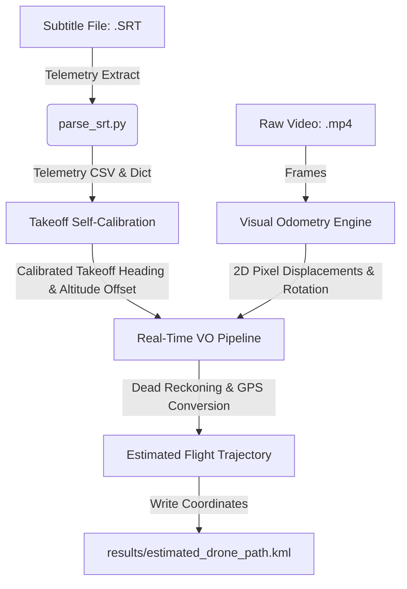

# Drone Visual Odometry (VO) & Telemetry Integration Pipeline

This project implements a **Visual Odometry (VO)** pipeline that estimates a drone's flight trajectory by processing downward-facing aerial video and synchronized telemetry data. By combining computer vision techniques with GPS metadata extracted from subtitle files (`.SRT`), the system performs visual dead reckoning to estimate the drone's position (Latitude, Longitude, and Altitude) and exports the trajectory as a Google Earth KML path.

---

## Architecture Overview

The pipeline processes two primary sources of input data:
1. **Video (`.MP4`)**: A video recording captured by the drone's downward-facing camera.
2. **Subtitles (`.SRT`)**: Metadata containing relative/absolute altitude and GPS coordinates corresponding to each video frame.



---

## How the Algorithm Works (Step-by-Step)

The trajectory estimation is broken down into five distinct algorithmic phases:

### 1. Telemetry Data Extraction
* **File:** [parse_srt.py]
* **Process:** 
  1. The drone encodes telemetry information within subtitles (`.SRT`). The parser reads these subtitle blocks and uses regular expressions to extract `latitude`, `longitude`, `rel_alt` (altitude relative to takeoff location), and `abs_alt` (absolute height above sea level).
  2. Telemetry entries associated with $(0.0, 0.0)$ GPS coordinates are ignored as invalid initialization errors.
  3. Timestamps are converted into seconds:
     $$\text{Seconds} = \text{Hours} \times 3600 + \text{Minutes} \times 60 + \text{Seconds} + \frac{\text{Milliseconds}}{1000}$$

### 2. Takeoff Self-Calibration
* **File:** [realtime_vo_pipeline.py]
* **Goal:** Determine the initial takeoff direction (heading/yaw) and identify if the drone launched vertically.
  * **Heading Calibration (`self_calibrate_takeoff_heading`)**:
    * Since the drone's initial orientation is unknown, the pipeline waits until the drone has moved at least **15 meters** horizontally from its launch coordinate.
    * It calculates the flight course angle (bearing) using the GPS coordinates at that point.
    * Meanwhile, it runs Visual Odometry on the video frames leading up to that point, accumulating the rotation angles ($\sum -\theta$).
    * The takeoff heading is calibrated as: 
      $$\theta_{\text{takeoff}} = \theta_{\text{GPS\_course}} - \theta_{\text{accumulated\_VO\_rotation}}$$
  * **Takeoff Altitude Offset (`detect_takeoff_altitude_offset`)**:
    * Analyzes the first 20 seconds of flight. If the drone climbs vertically ($>15\text{m}$) but moves very little horizontally ($<10\text{m}$), the system defines this as a vertical takeoff and sets a baseline altitude offset equal to the starting relative altitude.

### 3. Visual Motion Estimation
* **File:** [visual_odometry.py]
  1. **Feature Detection:** For consecutive frames, **ORB (Oriented FAST and Rotated BRIEF)** detects and describes key features (corners, edges, distinct visual landmarks).
  2. **Descriptor Matching:** A **Brute-Force Matcher** maps descriptors between frames using Hamming distance. Only "good" matches (Hamming distance $< 50$) are kept.
  3. **Translation De-biasing:** Keypoint coordinates are centered around the image midpoint ($c_x, c_y$). This centers the coordinate frame and avoids misinterpreting zoom or rotation as camera translation.
  4. **Robust Transformation Fitting:** A **RANSAC-based Partial Affine Transform Estimator** (`cv2.estimateAffinePartial2D`) filters out outlier mismatches and computes the 2D affine transformation matrix:
     $$M = \begin{bmatrix} s \cos\theta & -s \sin\theta & t_x \\ s \sin\theta & s \cos\theta & t_y \end{bmatrix}$$
     From this matrix, it extracts the rotation change ($\theta$ in radians) and pixel displacements ($t_x, t_y$ in pixels):
     $$t_x = M[0, 2],\quad t_y = M[1, 2],\quad \theta = \text{atan2}(M[1, 0], M[0, 0])$$

### 4. Pixel-to-Meter Scaling
* **File:** [visual_odometry.py] (function `pixels_to_meters`)
* **Process:** 
  To convert pixel translations into physical meters, the system utilizes the drone's relative altitude ($H$) and the horizontal Field of View ($\text{FOV}$) of the camera.
  
  1. **Calculate Visible Ground Footprint Width ($W_g$)**:
     $$W_g = 2 \times H \times \tan\left(\frac{\text{FOV}_{\text{horizontal}}}{2}\right)$$
  
  2. **Calculate Scale Factor**:
     $$\text{meters\_per\_pixel} = \frac{W_g}{\text{Image Width}}$$
  
  3. **Determine Drone Displacement ($dx_m, dy_m$)**:
     * **X-Axis:** If ground features shift to the left ($-t_x$), the drone moved right ($+dx_m$):
       $$dx_m = -t_x \times \text{meters\_per\_pixel}$$
     * **Y-Axis:** If ground features shift down ($+t_y$ in OpenCV where $Y$ points downward), the drone moved forward ($+dy_m$):
       $$dy_m = t_y \times \text{meters\_per\_pixel}$$

### 5. Dead Reckoning & GPS Update
* **File:** [realtime_vo_pipeline.py]
* **Process:**
  1. **Heading Integration:** Rotation updates are accumulated:
     $$\theta_{\text{heading}} \leftarrow \theta_{\text{heading}} - \theta$$
     * *Noise Filter:* To avoid false rotations due to altitude changes, heading accumulation is suspended when the drone's climb/descent rate exceeds $0.5\text{m}$ between processed frames.
     * *Jitter Filter:* Only rotations $|\theta| > 0.002\text{ rad}$ are accumulated.
  2. **Coordinate Rotation:** Convert local drone displacements ($dx_m, dy_m$) into world-frame offsets ($dNorth, dEast$):
     $$dNorth = dy_m \cos(\theta_{\text{heading}}) - dx_m \sin(\theta_{\text{heading}})$$
     $$dEast = dy_m \sin(\theta_{\text{heading}}) + dx_m \cos(\theta_{\text{heading}})$$
  3. **GPS Position Tracking:** Convert meters into latitude and longitude updates:
     $$\text{Latitude}_{\text{new}} = \text{Latitude}_{\text{old}} + \frac{dNorth}{111,320.0}$$
     $$\text{Longitude}_{\text{new}} = \text{Longitude}_{\text{old}} + \frac{dEast}{111,320.0 \times \cos(\text{Latitude}_{\text{old}})}$$
  4. The absolute altitude is directly obtained from the closest telemetry point in time, and the resulting coordinates are written to [estimated_drone_path.kml]

---

## Project Directory Structure

```
Intro_to_nav_ex1/
│
├── data/                               # Input data directory
│   ├── v1.MP4                          # Drone flight video 1
│   ├── v1.SRT                          # Drone telemetry subtitles 1
│   ├── v2.MP4                          # Drone flight video 2
│   └── v2.SRT                          # Drone telemetry subtitles 2
│
├── results/                            # Generated output files
│   ├── telemetry.csv                   # Extracted telemetry data in CSV format
│   └── estimated_drone_path.kml        # Estimated trajectory (Open in Google Earth)
│
├── parse_srt.py                        # Extracts and formats telemetry from SRT subtitles
├── visual_odometry.py                  # Module implementing feature extraction and motion estimation
└── realtime_vo_pipeline.py             # Main entry point running the visual odometry dead-reckoning pipeline
```

---

##  Getting Started

### Prerequisites

Install the required dependencies using pip:
```bash
pip install opencv-python numpy
```

### Running the Pipeline

1. **Extract Telemetry CSV (Optional)**:
   Run `parse_srt.py` to parse subtitle files directly to a CSV:
   ```bash
   python parse_srt.py
   ```
   *Prompt:* Enter the SRT file name when asked (e.g. `v2.SRT`).

2. **Run Visual Odometry Trajectory Estimation**:
   Run `realtime_vo_pipeline.py` to run the visual dead-reckoning tracker:
   ```bash
   python realtime_vo_pipeline.py
   ```
   * This script will automatically load the video and subtitle files defined in the code, run frame-by-frame visual odometry, print the estimated position, and write the output path to `results/estimated_drone_path.kml`.
   * You can open the output `.kml` file inside **Google Earth** to visualize the estimated 3D flight path of the drone.
